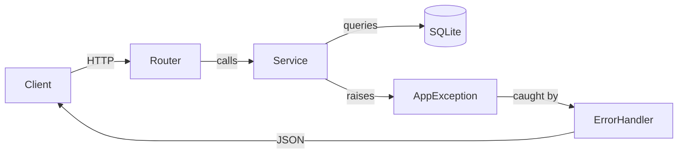
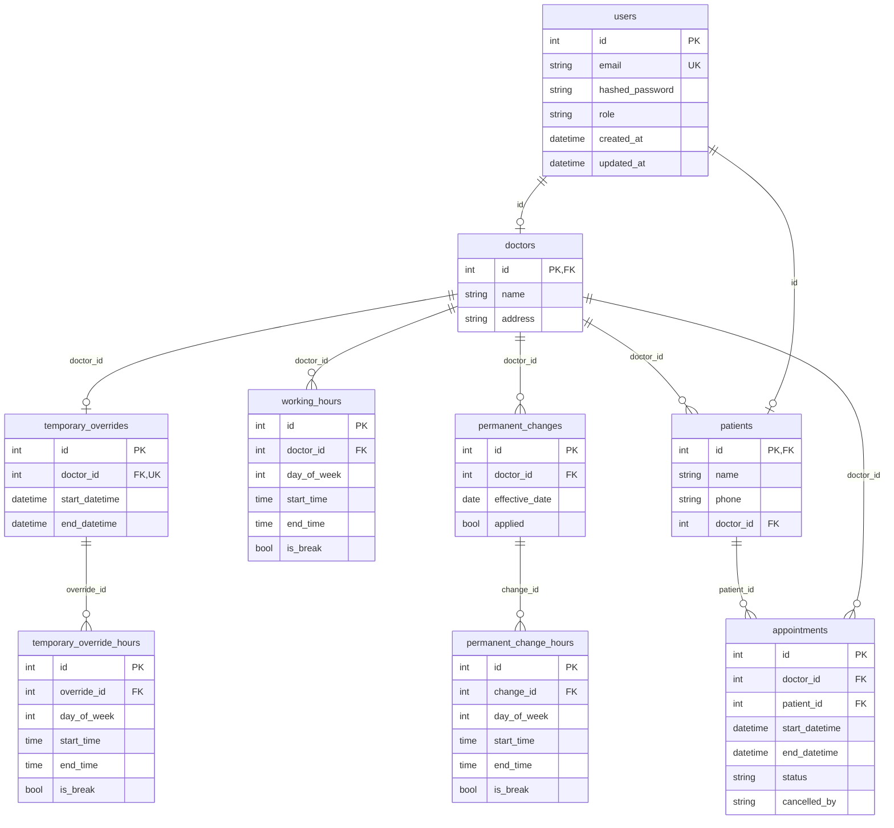
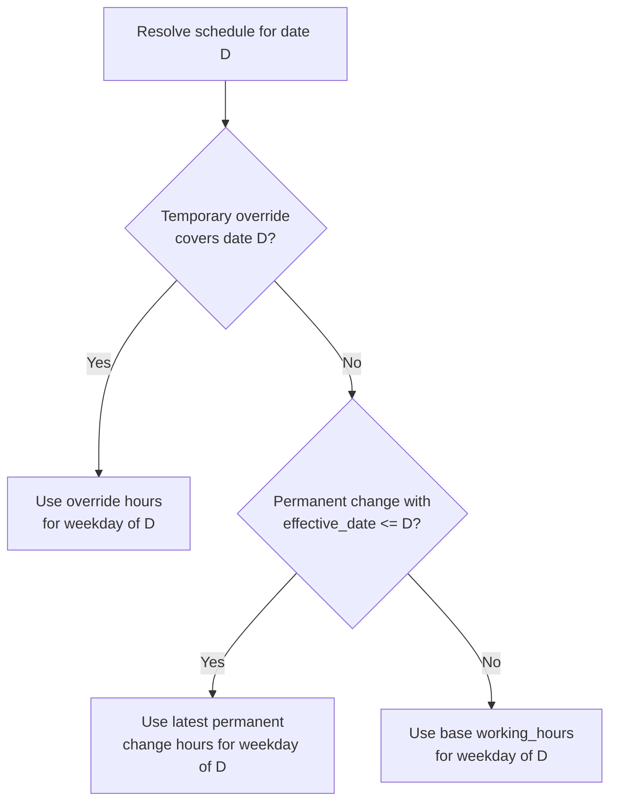

# Doctor Visit Booking API

A REST API for managing doctor visit bookings. Patients register with a personal doctor and book or cancel appointments within the doctor's working hours. Doctors manage their weekly schedules, including temporary overrides and permanent changes.

Built with **FastAPI**, **SQLAlchemy 2.0 (async)**, and **SQLite**.

## Business Rules

- A patient has exactly **one personal doctor**.
- Appointments can only be created with the patient's personal doctor.
- Appointments must fall entirely within the doctor's effective working hours.
- Appointments must be created at least **24 hours** before the start time.
- Appointments must not overlap with other scheduled appointments for the same doctor.
- Cancellation is allowed no later than **12 hours** before the appointment start.
- A doctor can have at most **1 active temporary schedule override**.
- Permanent schedule changes must have an effective date at least **7 days** in the future.

---

## Tech Stack

| Layer | Technology |
|---|---|
| Language | Python 3.9+ |
| Framework | FastAPI |
| ORM | SQLAlchemy 2.0 (async) |
| Database | SQLite via `aiosqlite` |
| Migrations | Alembic |
| Validation | Pydantic v2 |
| Auth | JWT (`python-jose` + `passlib[bcrypt]`) |
| Testing | pytest + pytest-asyncio + httpx |
| Linting | ruff |
| Type Checking | mypy (strict mode) |
| Containerization | Docker + Docker Compose |

---

## Project Structure

```
.
├── app/
│   ├── main.py                 # FastAPI app factory, lifespan, router mounting
│   ├── config.py               # Settings via pydantic-settings (.env)
│   ├── database.py             # Async engine, session factory, Base
│   ├── dependencies.py         # get_db, get_current_user, require_doctor/patient
│   ├── auth/
│   │   ├── router.py           # POST /auth/register/doctor, /patient, /login
│   │   ├── service.py          # Registration & login logic
│   │   ├── schemas.py          # Request/response Pydantic models
│   │   ├── security.py         # JWT creation, password hashing
│   │   └── models.py           # User model
│   ├── doctors/
│   │   ├── router.py           # GET /doctors, GET /doctors/{id}
│   │   ├── service.py          # Doctor listing & detail
│   │   ├── schemas.py          # DoctorResponse, DoctorListResponse
│   │   └── models.py           # Doctor model
│   ├── patients/
│   │   ├── router.py           # GET /patients/me
│   │   ├── service.py          # Patient profile retrieval
│   │   ├── schemas.py          # PatientResponse
│   │   └── models.py           # Patient model
│   ├── schedules/
│   │   ├── router.py           # Schedule CRUD endpoints
│   │   ├── service.py          # Schedule resolution (base > permanent > temporary)
│   │   ├── schemas.py          # TimeSlot, Override, PermanentChange schemas
│   │   └── models.py           # WorkingHours, TemporaryOverride, PermanentChange
│   ├── appointments/
│   │   ├── router.py           # POST/DELETE/GET /appointments
│   │   ├── service.py          # Booking, cancellation, listing + all validations
│   │   ├── schemas.py          # AppointmentCreateRequest, AppointmentResponse
│   │   └── models.py           # Appointment model
│   └── common/
│       ├── exceptions.py       # Custom exception hierarchy
│       └── error_handlers.py   # FastAPI exception handlers -> consistent JSON
├── alembic/                    # Migration environment
│   └── versions/               # Individual migration files
├── tests/
│   ├── conftest.py             # In-memory SQLite fixtures, dependency overrides
│   ├── factories.py            # Test data helpers (register, create payloads)
│   ├── test_auth/              # Auth registration & login tests
│   ├── test_doctors/           # Public doctor listing & detail tests
│   ├── test_patients/          # Patient profile tests
│   ├── test_schedules/         # Working hours, overrides, permanent changes
│   └── test_appointments/      # Create, cancel, list appointment tests
├── scripts/
│   └── seed.py                 # Optional dev DB seed (make seed)
├── Makefile                    # install, dev, test, lint, format, migrate, seed
├── pyproject.toml              # Dependencies, ruff/mypy/pytest config
├── Dockerfile
├── docker-compose.yml
├── .env.example
└── README.md
```

### Architecture

Routers are thin HTTP adapters that parse requests and return responses. All business logic lives in the **service layer**. Services interact with the database through **SQLAlchemy models** and raise custom exceptions for error cases. FastAPI exception handlers convert those exceptions into consistent JSON error responses.

```
Client  -->  Router  -->  Service  -->  SQLAlchemy Models  -->  SQLite
                             |
                     raises AppException
                             |
                     caught by error_handlers.py
                             |
                     JSON error response
```

---

## Setup

### Prerequisites

- **Python 3.9+** (3.12 recommended)
- `make` (optional but used in all commands below)
- **Docker** and **Docker Compose** (optional, for containerized runs)

### Local Development

```bash
# 1. Create and activate a virtual environment
python -m venv .venv
source .venv/bin/activate   # Windows: .venv\Scripts\activate

# 2. Install dependencies (production + dev)
make install

# 3. Configure environment
cp .env.example .env        # edit SECRET_KEY for production use

# 4. Create database and run migrations
mkdir -p data
make migrate

# 5. (Optional) Load demo doctor + patient for local testing
make seed
# Uses fixed emails/passwords from scripts/seed.py (dev-only). Re-run fails if those emails exist.

# 6. Start the development server
make dev
# -> http://127.0.0.1:8000
# -> Swagger UI at http://127.0.0.1:8000/docs
# -> ReDoc at http://127.0.0.1:8000/redoc
```

### Docker

```bash
cp .env.example .env
mkdir -p data
docker compose up --build
# -> http://127.0.0.1:8000
```

### Health Check

```bash
curl -s http://127.0.0.1:8000/health
# {"status":"ok"}
```

---

## API Reference

### Endpoints

| Method | Path | Auth | Role | Description |
|---|---|---|---|---|
| `POST` | `/auth/register/doctor` | No | -- | Register a new doctor |
| `POST` | `/auth/register/patient` | No | -- | Register a new patient |
| `POST` | `/auth/login` | No | -- | Login, receive JWT |
| `GET` | `/doctors` | No | -- | List all doctors (paginated) |
| `GET` | `/doctors/{id}` | No | -- | Get doctor details + working hours |
| `GET` | `/patients/me` | Yes | Patient | Get own profile |
| `PUT` | `/doctors/me/schedule` | Yes | Doctor | Update base working hours |
| `GET` | `/doctors/{id}/schedule` | No | -- | Get effective schedule for a date |
| `POST` | `/doctors/me/schedule/temporary` | Yes | Doctor | Create temporary override |
| `DELETE` | `/doctors/me/schedule/temporary` | Yes | Doctor | Remove temporary override |
| `POST` | `/doctors/me/schedule/permanent` | Yes | Doctor | Create permanent schedule change |
| `POST` | `/appointments` | Yes | Patient | Create appointment |
| `DELETE` | `/appointments/{id}` | Yes | Both | Cancel appointment |
| `GET` | `/appointments` | Yes | Both | List own appointments (filtered) |

### Error Response Format

All application errors use a consistent JSON structure:

```json
{
  "detail": {
    "code": "APPOINTMENT_OVERLAP",
    "message": "The requested time slot overlaps with an existing appointment."
  }
}
```

### HTTP Status Codes

| Code | Meaning |
|---|---|
| `200` | Success (GET, PUT) |
| `201` | Created (POST that creates a resource) |
| `204` | No Content (DELETE success) |
| `400` | Bad Request (malformed input) |
| `401` | Unauthorized (missing or invalid token) |
| `403` | Forbidden (wrong role or not the owner) |
| `404` | Not Found |
| `409` | Conflict (duplicate email, overlapping appointment, existing override) |
| `422` | Unprocessable Entity (business rule violation or validation error) |

### Error Code Catalog

| Code | HTTP | When |
|---|---|---|
| `EMAIL_EXISTS` | 409 | Registration with an already-used email |
| `INVALID_CREDENTIALS` | 401 | Login with wrong email or password |
| `INVALID_TOKEN` | 401 | Missing, expired, or malformed JWT |
| `DOCTOR_REQUIRED` | 403 | Non-doctor accessing a doctor-only endpoint |
| `PATIENT_REQUIRED` | 403 | Non-patient accessing a patient-only endpoint |
| `DOCTOR_NOT_FOUND` | 404 | Referenced doctor does not exist |
| `PATIENT_NOT_FOUND` | 404 | Referenced patient does not exist |
| `NOT_PERSONAL_DOCTOR` | 403 | Booking with a doctor who is not the patient's assigned doctor |
| `TOO_SOON` | 422 | Appointment start is less than 24 hours away |
| `INVALID_TIME_RANGE` | 422 | End time is before start time, or appointment spans multiple days |
| `OUTSIDE_WORKING_HOURS` | 422 | Appointment does not fit within effective working hours |
| `APPOINTMENT_OVERLAP` | 409 | Time slot conflicts with an existing scheduled appointment |
| `APPOINTMENT_NOT_FOUND` | 404 | Appointment ID does not exist |
| `ALREADY_CANCELLED` | 409 | Attempting to cancel an already-cancelled appointment |
| `NOT_APPOINTMENT_OWNER` | 403 | User is neither the doctor nor the patient of the appointment |
| `CANCELLATION_TOO_LATE` | 422 | Cancellation less than 12 hours before the appointment |
| `OVERRIDE_EXISTS` | 409 | Doctor already has an active temporary override |
| `OVERRIDE_NOT_FOUND` | 404 | No temporary override to delete |
| `INVALID_OVERRIDE_WINDOW` | 422 | Override end_datetime is before start_datetime |
| `EFFECTIVE_DATE_TOO_SOON` | 422 | Permanent change effective date is less than 7 days away |
| `UNSUPPORTED_ROLE` | 403 | User role is not doctor or patient |

---

## Request/Response Examples

### Register a Doctor

```bash
curl -X POST http://127.0.0.1:8000/auth/register/doctor \
  -H "Content-Type: application/json" \
  -d '{
    "name": "Dr. Smith",
    "email": "smith@example.com",
    "password": "securepass123",
    "address": "123 Medical Blvd",
    "working_hours": [
      {"day_of_week": 0, "start_time": "09:00:00", "end_time": "17:00:00", "is_break": false},
      {"day_of_week": 0, "start_time": "12:00:00", "end_time": "13:00:00", "is_break": true},
      {"day_of_week": 1, "start_time": "09:00:00", "end_time": "17:00:00", "is_break": false}
    ]
  }'
```

**201 Response:**

```json
{
  "access_token": "eyJhbGciOiJIUzI1NiIs...",
  "token_type": "bearer"
}
```

### Register a Patient

```bash
curl -X POST http://127.0.0.1:8000/auth/register/patient \
  -H "Content-Type: application/json" \
  -d '{
    "name": "Jane Doe",
    "email": "jane@example.com",
    "password": "securepass123",
    "phone": "+359888123456",
    "doctor_id": 1
  }'
```

**201 Response:**

```json
{
  "access_token": "eyJhbGciOiJIUzI1NiIs...",
  "token_type": "bearer"
}
```

### Login

```bash
curl -X POST http://127.0.0.1:8000/auth/login \
  -H "Content-Type: application/json" \
  -d '{"email": "jane@example.com", "password": "securepass123"}'
```

**200 Response:**

```json
{
  "access_token": "eyJhbGciOiJIUzI1NiIs...",
  "token_type": "bearer"
}
```

### Create an Appointment

```bash
curl -X POST http://127.0.0.1:8000/appointments \
  -H "Content-Type: application/json" \
  -H "Authorization: Bearer <patient_token>" \
  -d '{
    "doctor_id": 1,
    "start_datetime": "2026-04-16T10:00:00Z",
    "end_datetime": "2026-04-16T11:00:00Z"
  }'
```

**201 Response:**

```json
{
  "id": 1,
  "doctor_id": 1,
  "patient_id": 2,
  "start_datetime": "2026-04-16T10:00:00Z",
  "end_datetime": "2026-04-16T11:00:00Z",
  "status": "scheduled",
  "cancelled_by": null
}
```

### Cancel an Appointment

```bash
curl -X DELETE http://127.0.0.1:8000/appointments/1 \
  -H "Authorization: Bearer <patient_or_doctor_token>"
```

**204 No Content** (empty body on success).

### List Appointments

```bash
curl "http://127.0.0.1:8000/appointments?status=scheduled&date_from=2026-04-15&date_to=2026-04-30&skip=0&limit=10" \
  -H "Authorization: Bearer <token>"
```

**200 Response:**

```json
{
  "items": [
    {
      "id": 1,
      "doctor_id": 1,
      "patient_id": 2,
      "start_datetime": "2026-04-16T10:00:00Z",
      "end_datetime": "2026-04-16T11:00:00Z",
      "status": "scheduled",
      "cancelled_by": null
    }
  ],
  "total": 1,
  "skip": 0,
  "limit": 10
}
```

### Update Base Schedule

```bash
curl -X PUT http://127.0.0.1:8000/doctors/me/schedule \
  -H "Content-Type: application/json" \
  -H "Authorization: Bearer <doctor_token>" \
  -d '{
    "slots": [
      {"day_of_week": 0, "start_time": "08:00:00", "end_time": "16:00:00", "is_break": false},
      {"day_of_week": 1, "start_time": "08:00:00", "end_time": "16:00:00", "is_break": false}
    ]
  }'
```

**200 Response:**

```json
{
  "items": [
    {"id": 10, "day_of_week": 0, "start_time": "08:00:00", "end_time": "16:00:00", "is_break": false},
    {"id": 11, "day_of_week": 1, "start_time": "08:00:00", "end_time": "16:00:00", "is_break": false}
  ]
}
```

### Create Temporary Override

```bash
curl -X POST http://127.0.0.1:8000/doctors/me/schedule/temporary \
  -H "Content-Type: application/json" \
  -H "Authorization: Bearer <doctor_token>" \
  -d '{
    "start_datetime": "2026-04-20T00:00:00Z",
    "end_datetime": "2026-04-25T00:00:00Z",
    "schedule": [
      {"day_of_week": 0, "start_time": "10:00:00", "end_time": "14:00:00", "is_break": false}
    ]
  }'
```

**201 Response:**

```json
{
  "id": 1,
  "start_datetime": "2026-04-20T00:00:00Z",
  "end_datetime": "2026-04-25T00:00:00Z",
  "schedule": [
    {"id": 5, "day_of_week": 0, "start_time": "10:00:00", "end_time": "14:00:00", "is_break": false}
  ]
}
```

### Create Permanent Schedule Change

```bash
curl -X POST http://127.0.0.1:8000/doctors/me/schedule/permanent \
  -H "Content-Type: application/json" \
  -H "Authorization: Bearer <doctor_token>" \
  -d '{
    "effective_date": "2026-04-25",
    "schedule": [
      {"day_of_week": 0, "start_time": "07:00:00", "end_time": "15:00:00", "is_break": false}
    ]
  }'
```

**201 Response:**

```json
{
  "id": 1,
  "effective_date": "2026-04-25",
  "applied": false,
  "schedule": [
    {"id": 7, "day_of_week": 0, "start_time": "07:00:00", "end_time": "15:00:00", "is_break": false}
  ]
}
```

---

## Architecture and Design

### Request Flow



### Database Schema



### Schedule Resolution

When determining the effective schedule for a doctor on a given date, the system applies the following priority:



### SOLID Principles

**Single Responsibility** -- Each feature module (`auth/`, `doctors/`, `patients/`, `schedules/`, `appointments/`) owns one domain concept. Within a module, routers handle HTTP concerns, services contain business logic, and models define persistence.

**Open/Closed** -- The schedule resolution logic checks temporary overrides, then permanent changes, then base hours in sequence. Adding a new schedule type (e.g., holiday calendars) means adding a new check step without modifying existing resolution code.

**Liskov Substitution** -- Both `Doctor` and `Patient` link to the same `User` model for authentication. Any code that operates on a `User` (JWT decoding, token creation) works identically regardless of whether the user is a doctor or patient.

**Interface Segregation** -- Pydantic schemas are scoped per operation. `DoctorRegisterRequest` differs from `DoctorResponse`; `AppointmentCreateRequest` differs from `AppointmentResponse`. Consumers only see the fields relevant to their operation.

**Dependency Inversion** -- Services depend on the `AsyncSession` abstraction, never on a concrete database engine. Swapping SQLite for PostgreSQL requires only changing the `DATABASE_URL` configuration -- zero service code changes.

---

## Testing

### Running Tests

```bash
make test    # runs pytest with coverage report
```

### Test Suite Overview

The project has **26 integration tests** organized by feature:

| Module | Tests | What is tested |
|---|---|---|
| `test_auth/test_register.py` | 3 | Doctor/patient registration, duplicate email |
| `test_auth/test_login.py` | 3 | Successful login, wrong password, missing token |
| `test_schedules/test_working_hours.py` | 2 | Update base schedule, effective schedule query |
| `test_schedules/test_temporary_override.py` | 4 | Create, conflict, delete, schedule resolution |
| `test_schedules/test_permanent_change.py` | 3 | Create, too-soon rejection, resolution with change |
| `test_appointments/test_create.py` | 5 | Success, non-personal doctor, outside hours, too soon, overlap |
| `test_appointments/test_cancel.py` | 4 | Patient cancel, doctor cancel, already cancelled, too late |
| `test_appointments/test_list.py` | 1 | Each user sees only their own appointments |
| `test_health.py` | 1 | Health check endpoint |

### Test Isolation

Tests use an **in-memory SQLite** database created fresh for each test function. The production `get_db` dependency is overridden via `app.dependency_overrides` so that all requests within a test use the isolated database. Tables are created with `Base.metadata.create_all` (no Alembic dependency in tests) and dropped after each test.

---

## Development Tools

### Linting and Formatting

```bash
make lint      # ruff check + mypy strict
make format    # ruff format + auto-fixes
```

**Ruff** is configured in `pyproject.toml` with rules: `E`, `F`, `I`, `UP`, `B`, `SIM`, `RUF`. Line length is 88 characters.

**Mypy** runs in strict mode with the Pydantic plugin enabled.

### Database Migrations

```bash
make migrate           # apply all pending migrations
make migration         # create a new auto-generated migration
```

Migrations are managed by **Alembic**. Every schema change gets its own migration file with a descriptive message.

### Environment Variables

| Variable | Default | Description |
|---|---|---|
| `DATABASE_URL` | `sqlite+aiosqlite:///./data/db.sqlite3` | SQLAlchemy async database URL |
| `SECRET_KEY` | `change-me-in-production` | Secret key for JWT signing |
| `ACCESS_TOKEN_EXPIRE_MINUTES` | `60` | JWT token lifetime in minutes |
| `DEBUG` | `false` | Enable debug mode |

Copy `.env.example` to `.env` and adjust values as needed. Never commit `.env` to version control.
